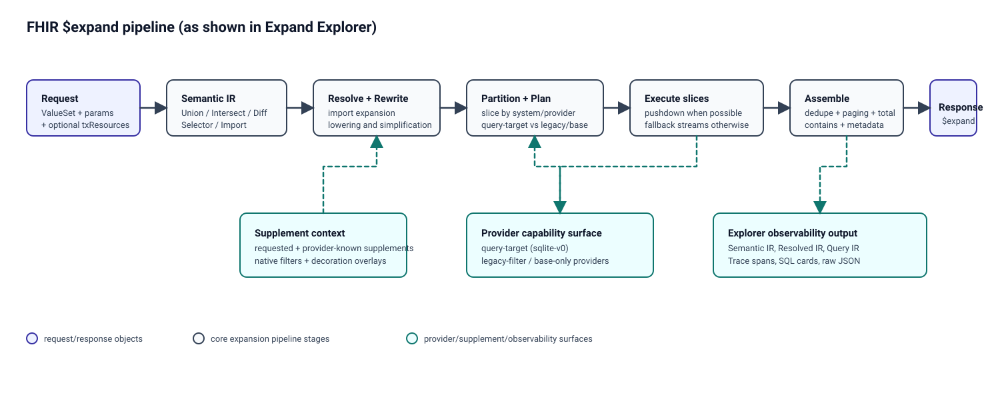

# Expand Explorer — Pipeline Tutorial and Capability Showcase

Expand Explorer is an execution debugger for production-grade FHIR `$expand`.
It runs full requests (ValueSet, parameters, and optional `txResources`) through
the same engine used in real expansion, then exposes every major pipeline stage:
semantic IR, resolved/re-written IR, provider partitioning, query lowering,
execution traces, SQL, and final assembled output. This is meant for developers
who understand terminology semantics and want to inspect exactly how the engine
reaches a result, not just what the result is.

At a high level, the pipeline compiles compose semantics into IR, resolves
imports, applies rewrite/lowering passes, partitions work by code system and
provider capabilities, executes query-target and legacy/base slices under one
global include-minus-exclude contract, applies supplement-aware filtering and
decoration, and finally assembles/paginates the expansion response.

Hosted explorer:

- `https://valueset-expander.exe.xyz/expand-explorer.html`

## Runtime loadout used by this explorer

This explorer runs against the configured TX library source in
`data/config.json`, which currently points to
`tests/tx/fixtures/expand-v2-test-library.yaml`
(`tests/tx/fixtures/expand-test-library.yaml` is identical). In this loadout, full
functionality is still enabled (`$expand`, import resolution, filters,
designations/properties, supplements, trace/debug output); the point is to run
that functionality across both new sqlite query-target providers and pre-existing
legacy/base providers in the same server.

### New sqlite query-target providers (v0 path)

These are the high-volume providers intended to push filters/set operations into
SQL whenever possible:

- `http://snomed.info/sct` via `sqlite-v0!:sct_intl_20250201.v0.db`
- `http://loinc.org` via `sqlite-v0:loinc_281_full.v0.db`
- `http://www.nlm.nih.gov/research/umls/rxnorm` via `sqlite-v0:rxnorm_02022026.v0.db`

### Pre-existing legacy/base providers

These remain active and are intentionally demonstrated alongside sqlite slices:

- Internal legacy providers:
- `internal:lang`
- `internal:country`
- `internal:currency`
- `internal:areacode`
- `internal:mimetypes`
- `internal:usstates`
- UCUM grammar/base provider:
- `ucum:tx/data/ucum-essence.xml` (`http://unitsofmeasure.org`)
- Package-backed terminology content (legacy/provider-managed):
- `npm:hl7.terminology`
- `npm:fhir.tx.support.r4`

### Why this matters for the demos

Several tutorial cases intentionally combine these provider families to show:

- pushdown where query-target providers can fully handle a slice,
- partitioned execution when a request spans systems/providers,
- preserved global semantics across mixed execution paths.

## What this tool lets you do

You can run complex `ValueSet` definitions with real parameters:

- `count`, `offset`, `filter`
- `property` selection
- `includeDesignations`, `activeOnly`
- `useSupplement`
- `txResources` (inline CodeSystem / ValueSet resources for imports and overlays)

And you can inspect the resulting pipeline artifacts:

1. `Results`:
The final expansion output (`contains`, `total`, properties/designations).

2. `Semantic IR`:
The direct algebra from compose-level semantics (`Union`, `Intersect`, `Diff`,
`Selector`, `Import`).

3. `Resolved IR`:
IR after resolving imported ValueSets and reconciling nested include/exclude
graphs.

4. `Query IR`:
Provider-compilable representation when lowering succeeds for a target slice.

5. `Trace`:
Execution spans and SQL calls, with enough detail to see pushdown vs fallback
behavior and timing hotspots.

6. `Raw Response`:
Full debug payload from the expand endpoint.

## Pipeline tutorial: from request to result

### Stage 1: Build semantic set algebra from compose

Start by understanding that the engine models expansion as global set algebra:

- includes as unions/intersections
- excludes as a global subtraction

Use:

- <a href="https://valueset-expander.exe.xyz/expand-explorer.html#SNOMED%20complex%20include%2Fexclude" target="_blank" rel="noopener noreferrer">SNOMED complex include/exclude</a>

What to look at:

- `Semantic IR` should clearly show a `Diff` whose left/right sides are unions.
- `Results` should align with the expected final set semantics.

### Stage 2: Resolve imports across resource boundaries

Next, inspect how imported ValueSets are expanded into the working expression.

Use:

- <a href="https://valueset-expander.exe.xyz/expand-explorer.html#Deep%20import%20include%20graph" target="_blank" rel="noopener noreferrer">Deep import include graph</a>
- <a href="https://valueset-expander.exe.xyz/expand-explorer.html#Deep%20import%20include%20minus%20exclude%20graph" target="_blank" rel="noopener noreferrer">Deep import include minus exclude graph</a>

What to look at:

- `Resolved IR` should show flattened/reconciled structure from nested
  `txResources` imports.
- You should see how deep include/exclude graphs become executable set
  operations.

### Stage 3: Partition by system/provider and lower where possible

After resolution, the engine partitions work by system/provider boundaries and
lowers eligible slices toward query-target execution.

Use:

- <a href="https://valueset-expander.exe.xyz/expand-explorer.html#Deep%20mixed%20import%20graph%20(SNOMED%2BLOINC" target="_blank" rel="noopener noreferrer">Deep mixed import graph (SNOMED+LOINC)</a>)
- <a href="https://valueset-expander.exe.xyz/expand-explorer.html#Deep%20mixed%20include-minus-exclude%20(SNOMED%2BLOINC" target="_blank" rel="noopener noreferrer">Deep mixed include-minus-exclude (SNOMED+LOINC)</a>)

What to look at:

- `Resolved IR` should still reflect global semantics.
- `Trace` should reflect separate execution slices for SNOMED and LOINC work.
- `Query IR` should appear where a slice is compilable for provider pushdown.

### Stage 4: Execute pushdown-capable slices at SQL scale

For query-target providers, large filters and paging should stay provider-local.

Use:

- <a href="https://valueset-expander.exe.xyz/expand-explorer.html#SNOMED%20is-a%20deep%20page" target="_blank" rel="noopener noreferrer">SNOMED is-a deep page</a>
- <a href="https://valueset-expander.exe.xyz/expand-explorer.html#LOINC%20STATUS%3DACTIVE%20deep%20page" target="_blank" rel="noopener noreferrer">LOINC STATUS=ACTIVE deep page</a>
- <a href="https://valueset-expander.exe.xyz/expand-explorer.html#RxNorm%20TTY%3DSBD" target="_blank" rel="noopener noreferrer">RxNorm TTY=SBD</a>
- <a href="https://valueset-expander.exe.xyz/expand-explorer.html#SNOMED%20code%20regex%207.*" target="_blank" rel="noopener noreferrer">SNOMED code regex 7.*</a>

What to look at:

- `Trace` timing and SQL cards should show bounded/paged database execution.
- Returned page sizes should match requested `count` where available.

### Stage 5: Evaluate count behavior and total policy

Count-only is a useful way to inspect total computation without result payload.

Use:

- <a href="https://valueset-expander.exe.xyz/expand-explorer.html#SNOMED%20complex%20count-only" target="_blank" rel="noopener noreferrer">SNOMED complex count-only</a>

What to look at:

- `Results` intentionally has empty `contains` for `count=0`.
- `total` should be present when the count path can be computed.

### Stage 6: Apply supplements for filtering and decoration

Supplements are first-class in execution and output: they can influence
membership (via filter clauses) and decoration (properties/designations).

Use:

- <a href="https://valueset-expander.exe.xyz/expand-explorer.html#LOINC%20supplement%20d20%20filter" target="_blank" rel="noopener noreferrer">LOINC supplement d20 filter</a>
- <a href="https://valueset-expander.exe.xyz/expand-explorer.html#LOINC%20supplement%20d20%2Bd8%20filter" target="_blank" rel="noopener noreferrer">LOINC supplement d20+d8 filter</a>
- <a href="https://valueset-expander.exe.xyz/expand-explorer.html#LOINC%20supplement%20decoration-only" target="_blank" rel="noopener noreferrer">LOINC supplement decoration-only</a>
- <a href="https://valueset-expander.exe.xyz/expand-explorer.html#RxNorm%20filter%20%2B%20supplement%20decoration" target="_blank" rel="noopener noreferrer">RxNorm filter + supplement decoration</a>

What to look at:

- `Results` should include requested supplement properties and designations.
- `Trace` should show whether supplement predicates were handled natively in the
  provider execution path.

### Stage 7: Mix execution families safely

The same expansion can combine query-target, legacy/internal, and base-only
providers while preserving global semantics.

Use:

- <a href="https://valueset-expander.exe.xyz/expand-explorer.html#LOINC%20%2B%20USPS%20mixed%20providers" target="_blank" rel="noopener noreferrer">LOINC + USPS mixed providers</a>
- <a href="https://valueset-expander.exe.xyz/expand-explorer.html#Cross-provider%20excludes" target="_blank" rel="noopener noreferrer">Cross-provider excludes</a>
- <a href="https://valueset-expander.exe.xyz/expand-explorer.html#UCUM%20base-only%20path" target="_blank" rel="noopener noreferrer">UCUM base-only path</a>
- <a href="https://valueset-expander.exe.xyz/expand-explorer.html#TX-resource%20import%20%2B%20sqlite%20peer" target="_blank" rel="noopener noreferrer">TX-resource import + sqlite peer</a>

What to look at:

- `Results` should still reflect one global include-minus-exclude contract.
- `Trace` should make partitioned execution visible across provider families.

### Stage 8: Observe rewrite-specific optimizations

These cases are useful for showing optimizer behavior, not only correctness.

Use:

- <a href="https://valueset-expander.exe.xyz/expand-explorer.html#Import%2Bfilter%20intersection%20lowering" target="_blank" rel="noopener noreferrer">Import+filter intersection lowering</a>
- <a href="https://valueset-expander.exe.xyz/expand-explorer.html#Import%20exclude%20lowering" target="_blank" rel="noopener noreferrer">Import exclude lowering</a>
- <a href="https://valueset-expander.exe.xyz/expand-explorer.html#Union%20merge%20lowering" target="_blank" rel="noopener noreferrer">Union merge lowering</a>
- <a href="https://valueset-expander.exe.xyz/expand-explorer.html#Provider-disjoint%20exclude%20pruning" target="_blank" rel="noopener noreferrer">Provider-disjoint exclude pruning</a>

What to look at:

- Compare `Semantic IR` and `Resolved IR`.
- Confirm pruning/merging/lowering intent in `Query IR` and `Trace`.

## Suggested demo flow (15–20 minutes)

1. `SNOMED complex include/exclude`
2. `Deep mixed include-minus-exclude (SNOMED+LOINC)`
3. `LOINC STATUS=ACTIVE deep page`
4. `LOINC supplement d20+d8 filter`
5. `LOINC + USPS mixed providers`
6. `Cross-provider excludes`

This sequence gives a coherent narrative:

- semantics,
- import reconciliation,
- lowering and partitioning,
- high-scale pushdown,
- supplements,
- hybrid execution correctness.
